# Ultimate Plex Companion

[](https://github.com/craiggoddenpayne/ultimate-plex-companion/actions/workflows/ci.yml) [](LICENSE) [](package.json) [](tsconfig.json)

A futuristic, local-first command centre for Plex. It combines live playback telemetry, explainable discovery, library health, metadata repair, direct media downloads, playlist generation, automations, guarded codec optimization and fifty experimental library analyses in one Docker-ready application.

> [!WARNING]
> The application has administrator-level Plex features and does not yet include its own login. Keep it on a trusted private network, behind an authenticated reverse proxy or private VPN.

## Screenshots

### Command Deck

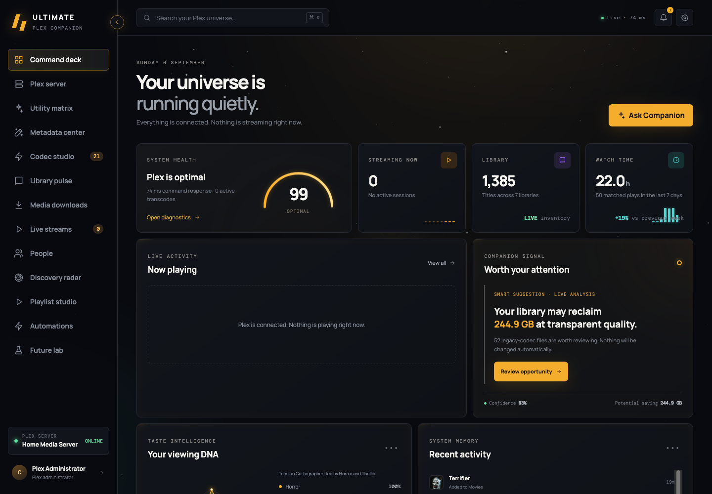

| Plex Server                                                                                                                                    | Utility Matrix                                                                                                                   |
| ---------------------------------------------------------------------------------------------------------------------------------------------- | -------------------------------------------------------------------------------------------------------------------------------- |
| 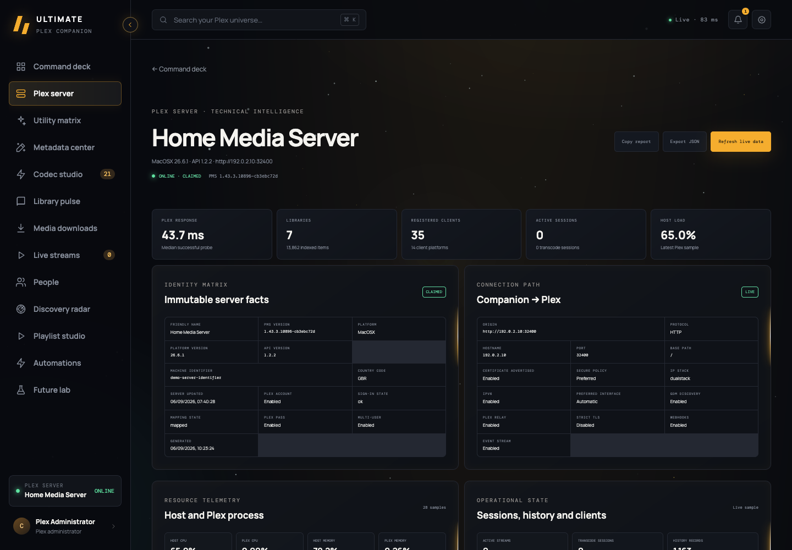                         | 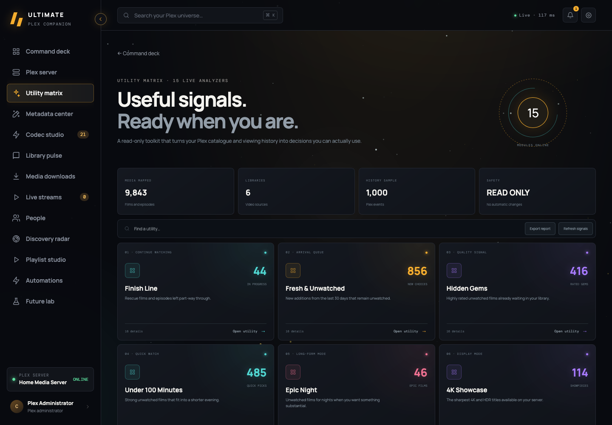                        |
| **Metadata Center**                                                                                                                            | **Codec Studio**                                                                                                                 |
| 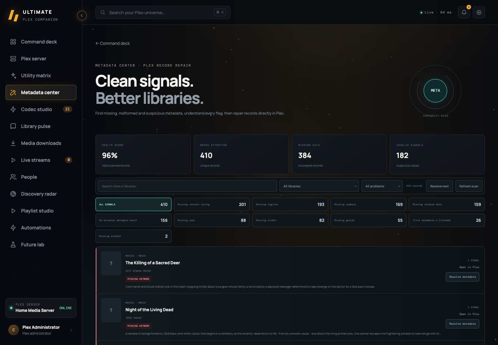                          | 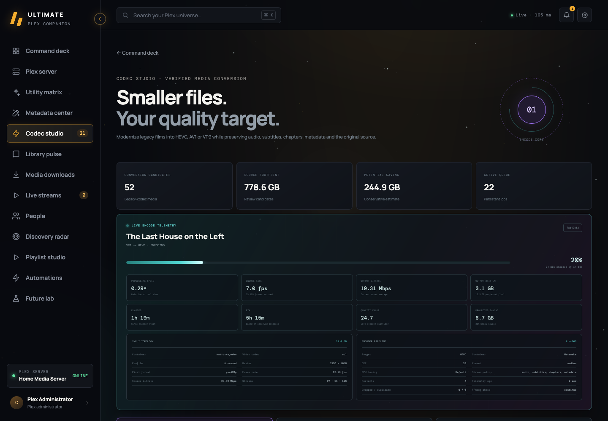 |
| **Library Pulse**                                                                                                                              | **Media Downloads**                                                                                                              |
| 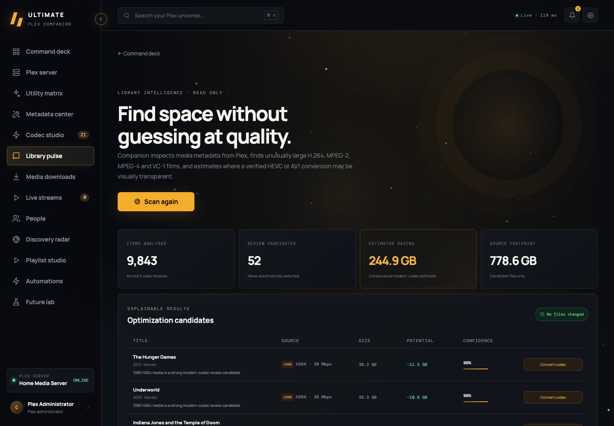                         | 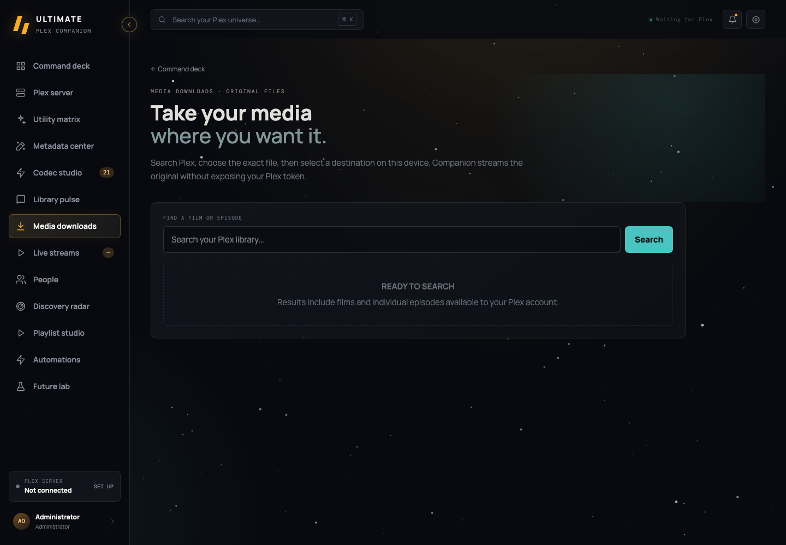              |
| **Live Streams**                                                                                                                               | **People**                                                                                                                       |
| 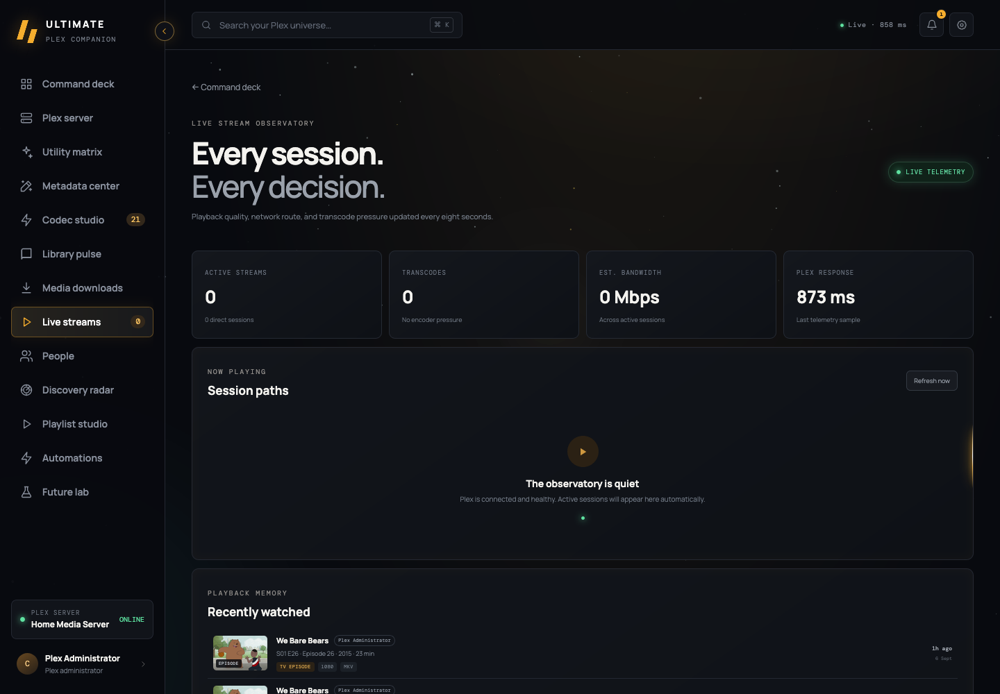                       | 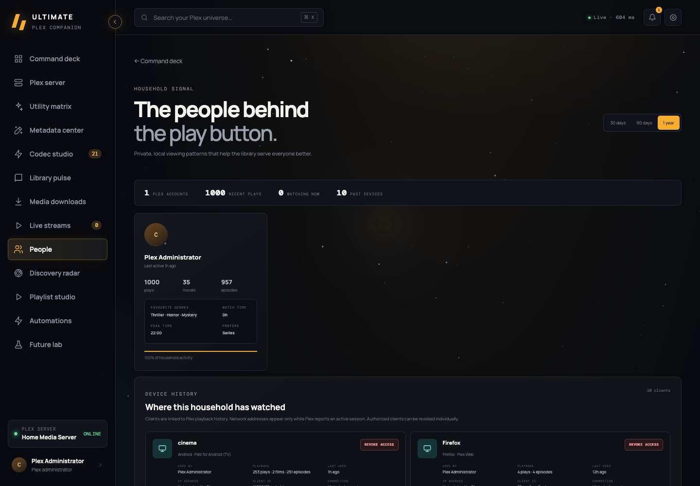                    |
| **Discovery Radar**                                                                                                                            | **Playlist Studio**                                                                                                              |
| 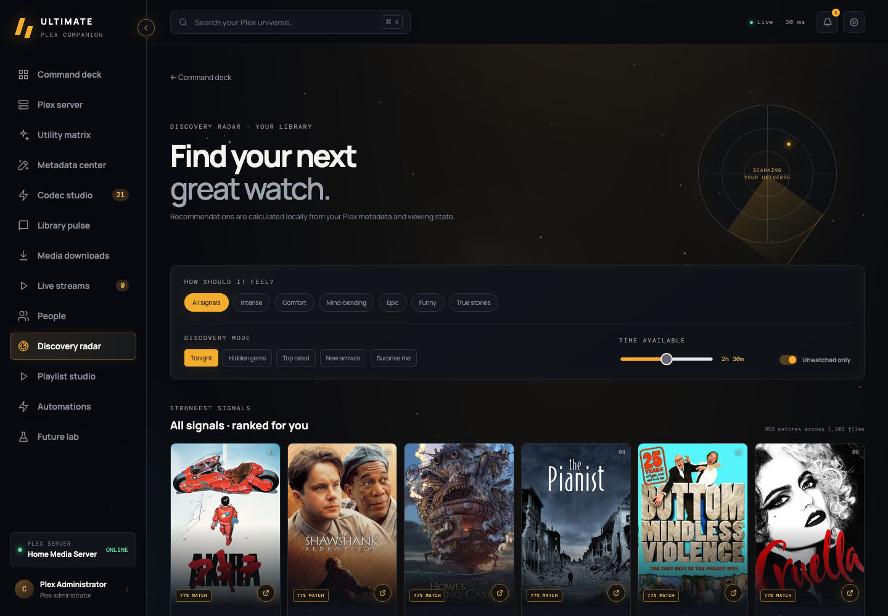 | 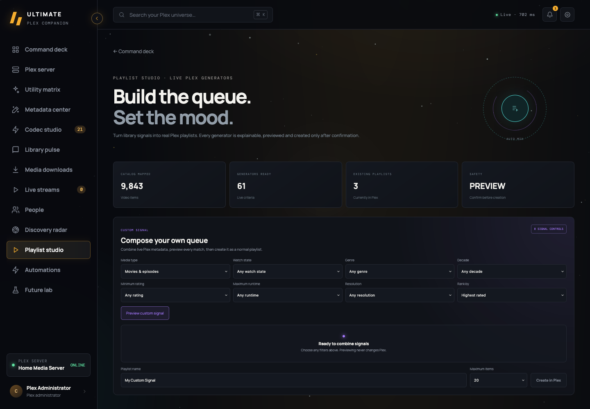                  |
| **Automation Core**                                                                                                                            | **Future Lab**                                                                                                                   |
| 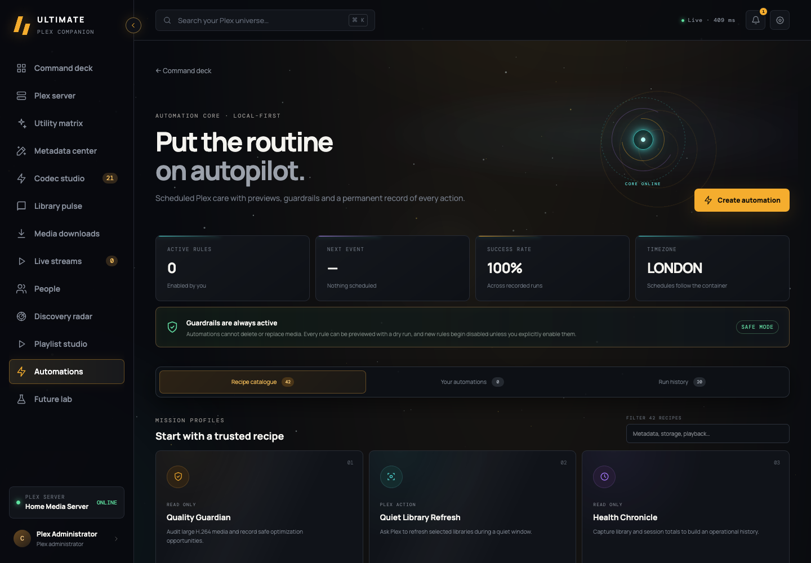                        | 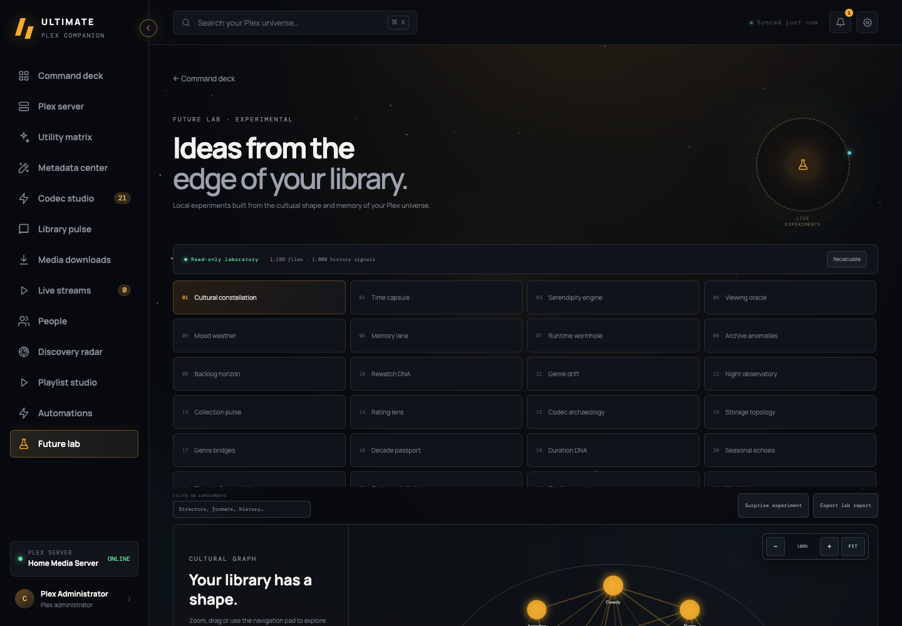                       |

Screenshots use anonymized server and account labels. Library artwork and statistics illustrate the live-data interface and vary with each Plex server.

## Highlights

- Live Plex server, stream and household telemetry
- Dedicated Plex Server intelligence with identity, networking, resource history, capabilities, library topology, client platforms, configuration overrides and endpoint latency
- Explainable Discovery Radar with expandable, library-based recommendations
- Playlist Studio with 62 live generators and an eight-control custom signal composer
- Direct movie and episode downloads to the device running the browser
- Metadata integrity scanning and guided repair
- Duplicate/edition review with copy-level evidence
- Persistent, verified HEVC, AV1 and VP9 conversion queues
- Forty-two auditable automation recipes with one-off runs, dry runs, schedules and detailed reports
- Fifty local Future Lab experiments, with filtering, JSON report export and random exploration
- Responsive command interface with fifteen themes and seven lightweight background visualizers
- Native Tauri bootstrap for macOS, iOS and Android companion clients
- Local processing with no external analytics

## Features

Ultimate Plex Companion is organized into thirteen main sections. Most are analytical and read-only. Features that can change Plex or the filesystem identify the exact action and ask for confirmation first.

### Command Deck

**What it does:** Command Deck is the home screen. It combines server availability, library totals, active playback, recent additions, storage signals, viewing trends and useful alerts into a single live overview. Artwork and direct Plex links make it possible to move from a signal to the relevant title quickly.

**Why it exists:** Plex information is normally spread across library, activity and settings screens. Command Deck answers the immediate questions—whether the server is healthy, what is playing, what changed and what needs attention—without making an administrator inspect each subsystem separately.

**Data impact:** Read-only. It observes Plex and Companion state.

### Plex Server

**What it does:** Plex Server is a deliberately technical report for the currently connected server. It exposes identity and claim state, versions, platform and API details, connection policy, capabilities, Streaming Brain and adaptive-bitrate settings, CPU and memory history, active workload, registered client platforms, library topology, scanners, agents, UUIDs, media paths, maintenance preferences, Companion path translation and timed endpoint probes. Reports can be copied or exported as JSON, while credentials remain excluded at the server boundary.

**Why it exists:** Server problems often come from the relationship between Plex configuration, networking, libraries and the host rather than one obvious error. This section puts the evidence required for troubleshooting, migration and configuration review in one place.

**Data impact:** Read-only. It never returns the Plex token to the browser.

### Utility Matrix

**What it does:** Utility Matrix provides fifteen focused analyzers over live library metadata and viewing history. Its lenses cover unfinished stories, new unwatched arrivals, playback readiness, rewatch candidates, storage pressure and other practical catalogue questions. Each result explains the evidence behind it and links back to Plex where possible.

**Why it exists:** Large libraries contain useful patterns that ordinary browsing cannot surface. The matrix turns those patterns into small, understandable decisions instead of presenting another general-purpose dashboard.

**Data impact:** Read-only. Analyzers do not edit titles or start maintenance work.

### Metadata Center

**What it does:** Metadata Center scans video libraries for missing artwork, summaries, genres and dates, as well as malformed or suspicious values such as impossible dates, conflicting years, weak local matches and incomplete episode numbering. The integrity score summarizes overall health. Guided repair opens the affected record with only the relevant fields available, supports locked Plex metadata edits and can select replacement artwork from a supplied URL.

**Why it exists:** Weak metadata makes search, recommendations, playlists and the Plex interface less reliable. A targeted review is safer and faster than opening thousands of items manually or replacing otherwise correct metadata wholesale.

**Data impact:** Scanning is read-only. Saving a repair changes the selected Plex metadata fields only after review and confirmation.

### Codec Studio

**What it does:** Codec Studio finds large or legacy video files and estimates the benefit of converting them to HEVC, AV1 or VP9. Jobs use a persistent, reorderable queue with pause, retry, cancel and removal controls. During an encode, live telemetry shows frames, FPS, processing speed, bitrate, quantizer, bytes written, elapsed time, ETA, projected saving, source topology, stream counts and encoder settings. A completed output is checked for codec, duration, size, audio and subtitle preservation before it can replace anything.

**Why it exists:** Media conversion can reduce storage use substantially, but an opaque one-shot script is difficult to trust or recover. Codec Studio makes the process observable, resumable and conservative, with enough technical detail to diagnose a slow or failed encode.

**Data impact:** Encoding writes a separate temporary MKV beside the source. The original remains untouched until an administrator explicitly approves replacement. Removing a queued job deletes only its queue record.

### Library Pulse

**What it does:** Library Pulse maps the collection by resolution, HDR, bitrate, codecs, storage size, editions, media versions, metadata quality and growth. Duplicate and alternate-edition views provide copy-level evidence so files can be compared before any decision is made. Storage forecasts highlight heavy titles and likely expansion pressure.

**Why it exists:** A title count alone says little about the health or cost of a library. Library Pulse shows where space is going, which copies may be redundant and where playback or metadata quality is uneven.

**Data impact:** Analysis is read-only. Deleting a duplicate requires selecting an exact media copy, reviewing its file evidence and confirming the Plex deletion request.

### Media Downloads

**What it does:** Media Downloads searches accessible movie and television libraries, lists every available media version with its resolution, format and size, and streams the chosen original through Companion to the browser. The browser's normal save flow chooses the destination, including a different computer from the Plex server.

**Why it exists:** Plex media paths describe storage visible to the server and are often meaningless on another device. Browser delivery provides a straightforward way to retrieve the exact existing file without sharing that filesystem or transcoding the media.

**Data impact:** Read-only on the Plex server. It transfers a copy to the browser and does not alter the source.

### Live Streams

**What it does:** Live Streams presents every active session with the viewer, client, device, product, local or remote route, IP evidence, bandwidth, progress and playback decision. Technical details distinguish direct play, direct stream and full transcode paths, including container-only remuxes and the active video/audio conversion pipeline.

**Why it exists:** A simple “playing” indicator cannot explain buffering, remote bandwidth use or unexpected transcoding. This section exposes the complete delivery path so playback problems can be understood while they are happening.

**Data impact:** Read-only. It observes current Plex sessions.

### People

**What it does:** People builds private viewing profiles for Plex accounts and household members, including watched titles, genres, recent activity and shared taste signals. A separate device-history area lists the clients that have viewed content in the past, with device name, product, platform, client identity, IP, last-seen evidence and current authorization state kept apart from the taste profile. An authorized client can be revoked directly from its card after confirmation.

**Why it exists:** Household recommendations and playback troubleshooting need different kinds of evidence. Separating viewing preferences from technical device history keeps the profiles understandable while still making old clients and network routes available when an administrator needs them.

**Data impact:** Profile analysis is read-only and stays local. Revoking a client removes that device's Plex account authorization so it must sign in again; the confirmation identifies the selected client, and historical viewing records remain available.

### Discovery Radar

**What it does:** Discovery Radar ranks films already present in the library using mood, runtime, rating, recency and watch-state controls. Every result includes a plain-language reason for its position. Tonight, hidden-gem, top-rated, recent and surprise modes offer different ranking strategies, while **Show more** continues through the ranked catalogue without repeating earlier results or dropping the selected filters.

**Why it exists:** Conventional recommendations often hide their reasoning and promote content that is not available locally. Discovery Radar explains each suggestion and concentrates on finding value in media the household already owns.

**Data impact:** Read-only. Opening a result hands the title back to Plex.

### Playlist Studio

**What it does:** Playlist Studio contains 62 live, explainable playlist generators covering genre, era, runtime, quality, codec, format, viewing progress, mood and situational choices. Search and category filters make the collection manageable. The custom signal composer can combine genre, year, runtime, rating, resolution, codec, watch state and sorting rules, with live match counts and sample titles shown before creation.

**Why it exists:** Plex smart filters are powerful but can be time-consuming to assemble and difficult to reuse. Playlist Studio turns useful criteria into named recipes while still showing exactly which titles will be included.

**Data impact:** Previewing is read-only. Creating a playlist requires confirmation and creates only the reviewed playlist in Plex.

### Automations

**What it does:** Automations provides 42 recipes for library health, metadata, storage, formats, arrivals, playback, backlog, discovery and growth. Separate Recipe catalogue, Your automations and Run history views keep reports accessible without scrolling through the catalogue. Every recipe can run immediately without creating a rule, or be configured to run hourly, daily or weekly. New rules begin disabled, every configured rule supports a dry preview, and the latest 100 reports remain available locally with the evidence and outcome recorded. Each completed report can be downloaded as formatted JSON, and a recipe filter keeps the larger catalogue quick to navigate.

**Why it exists:** Useful library checks are easy to forget and hard to compare over time. Scheduled, auditable reports make changes visible without turning maintenance into an unreviewed background process.

**Data impact:** Forty-one recipes are read-only. Quiet Library Refresh can request a normal Plex library scan, and its dry run identifies the affected libraries first. Automations never delete, replace or automatically encode media.

### Future Lab

**What it does:** Future Lab contains fifty experimental views that treat the server as a cultural and personal archive. They include an interactive genre/director graph, chronological collection views, iterable contrasting double features, detailed viewing-pattern analysis, memory timelines, people and production fingerprints, geographical and language maps, mood and genre movement, runtime exploration, collection archaeology, and deep video, audio and subtitle analysis. The experiments can be filtered by name and the complete model can be exported as JSON.

**Why it exists:** Operational dashboards describe whether a server works; Future Lab explores what the collection contains and how it has been experienced. It offers unusual, explainable perspectives that companion applications rarely attempt.

**Data impact:** Read-only. Experiments are calculated locally from catalogue metadata and viewing history.

### Shared controls and personalization

**What it does:** Global controls provide a ⌘K search and command palette for Plex media and Companion sections, live unread operational notifications, connection management, diagnostics, data reset, responsive navigation, adjustable text sizing, fifteen color themes and seven lightweight animated backgrounds. Background effects can be reduced or disabled independently. Native Tauri shells allow the same hosted Companion instance to be used from macOS, iOS and Android.

**Why it exists:** A companion used for both quick checks and long technical sessions needs to work across screen sizes, visual preferences and deployment models. Central controls keep those choices consistent across every section.

**Data impact:** Theme and interface preferences affect only Companion. Connection changes replace its saved Plex endpoint and token after validation. Data reset describes the affected local records before requiring confirmation.

## What makes Future Lab different

Future Lab turns catalogue and watch-history evidence into analyses that typical Plex dashboards do not provide. All calculations run on the Companion server and remain read-only.

- **Cultural Constellation** maps connections between genres and directors.
- **Time Capsule** arranges the archive across cinematic decades.
- **Serendipity Engine** creates deliberately contrasting double features.
- **Viewing Oracle** describes established time, day and genre habits.
- **Mood Weather** compares recent viewing pressure with the previous month.
- **Memory Lane** reconstructs a twelve-month viewing timeline.
- **Runtime Wormhole** makes every runtime band and time window explorable.
- **Archive Anomalies** finds rare genres, one-off directors and buried gems.
- **Backlog Horizon** forecasts the time needed to explore the unwatched library.
- **Rewatch DNA** reveals repeat-viewing rate, comfort films and comfort genres.
- **Genre Drift** detects genres rising and cooling across two 180-day windows.
- **Night Observatory** builds a private day-and-time viewing heatmap.
- **Collection Pulse** measures arrival velocity and new unwatched additions.
- **Rating Lens** charts rating distribution and highly rated sleepers.
- **Codec Archaeology** maps video codecs, containers, resolutions and legacy titles.
- **Storage Topology** maps title sizes, multi-version storage and the heaviest files.
- **Genre Bridges** finds unusual genre pairings and high-connectivity films.
- **Decade Passport** measures collection and watch progress through film history.
- **Duration DNA** compares the library's runtime with the household's actual viewing tempo.
- **Seasonal Echoes** reveals recurring monthly viewing and genre patterns across years.

Thirty expanded experiments add director and cast fingerprints, studio and country maps, audio and subtitle languages, certification patterns, franchises and collections, release-season analysis, arrival-to-watch delay, hidden decades, unfinished journeys, viewing rituals, rating agreement, resolution evolution, HDR, aspect ratios, bitrate outliers, container migration, alternate versions, per-library velocity, watchlist archaeology, diverse viewing chains and a personal canon.

Every title surfaced by an experiment links back to that item in Plex. The complete lab model can be exported as JSON, and **Surprise experiment** jumps to a different live analysis.

## Useful automations

The Automation Core includes twelve persistent recipes. New rules begin disabled, every recipe supports a dry run, and the latest 100 reports remain available locally.

- **Quality Guardian** records conservative codec optimization opportunities.
- **Quiet Library Refresh** requests a standard Plex scan for selected libraries.
- **Health Chronicle** captures server, library, session and transcode totals.
- **Arrival Digest** summarizes newly added media and its source paths.
- **Metadata Sentinel** checks artwork, summaries and release years.
- **Stream Sentinel** samples live direct-play and transcode pressure.
- **Backlog Age Radar** finds old and highly rated unwatched titles.
- **Format Drift Sentinel** tracks codec, resolution and unknown-format changes.
- **Edition Storage Sentinel** measures storage held by multiple media versions.
- **Library Growth Chronicle** records daily, weekly and monthly arrival growth.
- **Weekly Playback Digest** compares seven-day activity, titles and viewers.
- **New Media Integrity Guard** checks arrivals for media, duration, codec, resolution and size data.

Thirty additional read-only recipes cover artwork, summary, date, GUID, certification, genre, collection, cast, director and episode metadata; duplicate records; audio codecs, subtitle exposure, HDR, bitrate, containers, resolution, aspect ratios and multi-audio media; file-size and storage hotspots; media paths; stale additions, unwatched gems, rewatch favourites, incomplete playback, decade balance, recent-arrival quality and library distribution.

Forty-one recipes are read-only. Quiet Library Refresh is the only recipe that asks Plex to do work, and its dry run lists the exact libraries before any scan request is sent. Automations never delete, replace or automatically encode media.

## Playlist Studio signals

Playlist Studio contains 62 explainable generators. The original discovery, progress, runtime, cinema, mood, household and era recipes are joined by forty additional signals:

- Ten focused genre queues covering action, adventure, drama, fantasy, romance, animation, history/war, music, westerns and remarkable lives.
- Five additional era journeys from pre-1960 cinema through the current decade.
- Four precise runtime windows for compact films and short or prestige-length episodes.
- Five quality signals for audience nines, critic consensus, rating disagreements and unrated discoveries.
- Six cinema and media-format signals covering 1080p, SD rescue, HEVC, AV1, high bitrate and multiple editions.
- Four progress signals for barely started, nearly finished, repeatedly watched and recently loved titles.
- Six situational queues for feel-good viewing, adrenaline, rainy days, date nights, mind-benders and true stories.

Signals can be searched and filtered by category. Each card shows its live match count and sample titles before asking for confirmation to create a real Plex playlist.

## Build and run with Docker Compose

Requirements: Docker Engine with Compose v2, or Docker Desktop on macOS/Windows.

```bash
git clone https://github.com/craiggoddenpayne/ultimate-plex-companion.git
cd ultimate-plex-companion
cp .env.example .env
```

Edit `.env` before building. At minimum, confirm the port, time zone and media mapping. `PLEX_URL` and `PLEX_TOKEN` are optional because they can be entered later in **Manage Connection**.

```dotenv
APP_PORT=8080
TZ=Europe/London
PLEX_URL=http://host.docker.internal:32400
PLEX_TOKEN=
MEDIA_HOST_PATH=/path/on/docker-host/to/media
PLEX_MEDIA_ROOT=/path/reported/by/plex
MEDIA_CONTAINER_PATH=/media
```

Build the production image and start it:

```bash
docker compose build companion
docker compose up -d companion
docker compose ps
docker compose logs --tail=100 companion
```

Open `http://localhost:8080` or the configured `APP_PORT`, select **Manage Connection**, and enter the Plex server URL and X-Plex-Token. The connection is tested before it is stored.

Docker Desktop users can normally reach Plex on the host at `http://host.docker.internal:32400`. For a NAS or another machine, use its LAN address. See [deployment guidance](docs/DEPLOYMENT.md) for media path mapping and security recommendations.

The media mount is required for Codec Studio because that feature reads and writes the same files Plex reports. Downloads do not require a shared filesystem: the Companion server streams the selected Plex file to the browser, so Chrome can save it on a different computer.

Rebuild after pulling an update:

```bash
git pull
docker compose up -d --build companion
```

Application settings and queue state live in the named `companion-data` volume. `docker compose down` preserves it; `docker compose down -v` deletes it.

### Publish images to Docker Hub with GitHub Actions

The **Publish Docker image** workflow builds `linux/amd64` and `linux/arm64` images and pushes a combined multi-platform image to Docker Hub whenever `main` or a `v*` tag is pushed. It can also be started manually from GitHub Actions.

Configure these under **Repository settings → Secrets and variables → Actions**:

- Variable `DOCKERHUB_USERNAME`: Docker Hub account or organization used to authenticate.
- Variable `DOCKERHUB_IMAGE`: full Docker Hub image name, such as `craiggoddenpayne/ultimate-plex-companion`.
- Secret `DOCKERHUB_TOKEN`: a Docker Hub access token with permission to write that repository.

Commits on `main` publish `main`, `latest` and `sha-…` tags. A tag such as `v1.4.2` also publishes `1.4.2` and `1.4` tags. The workflow uses BuildKit's GitHub cache to reduce subsequent build time.

### Build and run without Compose

```bash
docker build -t ultimate-plex-companion:local .
docker run -d \
  --name ultimate-plex-companion \
  --restart unless-stopped \
  --read-only \
  --tmpfs /tmp:size=64m,mode=1777 \
  -p 8080:8080 \
  --add-host host.docker.internal:host-gateway \
  -v ultimate-plex-companion-data:/data \
  -v /path/on/docker-host/to/media:/media \
  -e TZ=Europe/London \
  -e PLEX_MEDIA_ROOT=/path/reported/by/plex \
  -e MEDIA_ROOT=/media \
  ultimate-plex-companion:local
```

## Local development

Requirements: Node.js 24+, npm and FFmpeg/FFprobe for codec features. Run `nvm use` to select the repository's declared Node release when using nvm.

```bash
npm ci
npm run server
```

In another terminal:

```bash
npm run dev
```

Useful checks:

```bash
npm run lint
npm run format:check
npm run check
npm test
npm run build
```

## Configuration

Configuration is stored in `/data` inside the container. You can configure Plex through the browser or the `PLEX_URL` and `PLEX_TOKEN` environment variables. Environment-managed credentials cannot be changed from the UI, and the token is never returned to the browser.

Codec Studio needs the same media files Plex reports. Configure:

- `MEDIA_HOST_PATH`: directory on the Docker host
- `PLEX_MEDIA_ROOT`: prefix present in Plex metadata
- `MEDIA_CONTAINER_PATH`: mount location inside Companion
- `HEVC_CRF`: quality value from 16–26 (default 20)
- `HEVC_PRESET`: `fast`, `medium` or `slow`

See [.env.example](.env.example) for a complete template.

## Build the native applications

The repository includes a lightweight Tauri 2 client for macOS, Android and iOS. The native app displays an existing Docker-hosted Companion instance. Plex credentials, FFmpeg, media access and persistent data remain on that server.

All native targets require Node.js 24+, npm, Rust and the checked-out repository:

```bash
npm ci
curl --proto '=https' --tlsv1.2 -sSf https://sh.rustup.rs | sh
source "$HOME/.cargo/env"
npm run native:doctor
```

`UPC_APP_URL` is compiled into the native shell. It must point to a running Companion server, not directly to Plex. Use HTTPS through a private VPN or authenticated reverse proxy when accessing the server away from home.

### Build for macOS

Install Xcode from the App Store or install its command-line tools:

```bash
xcode-select --install
npm run native:doctor -- macos
```

Run a development build against a local Docker service:

```bash
UPC_APP_URL=http://localhost:8080 npm run native:dev
```

Create the `.app` bundle and `.dmg`:

```bash
UPC_APP_URL=https://companion.example.net npm run native:build:macos
```

Artifacts are written beneath `src-tauri/target/release/bundle/macos` and `src-tauri/target/release/bundle/dmg`. Distribution to other Macs requires an Apple Developer certificate, hardened-runtime signing and notarization. A locally built unsigned app can still be used on the build Mac subject to its Gatekeeper settings.

### Build for Android

Install Android Studio, then use its SDK Manager to install an Android SDK platform, Platform Tools, Build Tools, NDK and command-line tools. On macOS, set the toolchain paths in the shell that runs the build:

```bash
export JAVA_HOME="/Applications/Android Studio.app/Contents/jbr/Contents/Home"
export ANDROID_HOME="$HOME/Library/Android/sdk"
export NDK_HOME="$ANDROID_HOME/ndk/REPLACE_WITH_INSTALLED_VERSION"
rustup target add aarch64-linux-android armv7-linux-androideabi i686-linux-android x86_64-linux-android
npm run native:doctor -- android
```

Initialize the generated Android project once per checkout, then build:

```bash
npm run native:init:android
UPC_APP_URL=https://companion.example.net npm run native:build:android
```

To launch the generated project through Android Studio and run a development session:

```bash
UPC_APP_URL=https://companion.example.net npm run native:open:android
```

Generated APK/AAB outputs are beneath `src-tauri/gen/android/app/build/outputs`. Configure an Android release keystore before publishing to Google Play. A phone cannot reach a server through `localhost`; use a LAN hostname/IP while at home or an HTTPS address reachable from the device.

### Build for iOS

iOS builds require macOS, full Xcode, an accepted Xcode licence and CocoaPods. Select Xcode and add the Rust targets:

```bash
sudo xcode-select -s /Applications/Xcode.app/Contents/Developer
sudo xcodebuild -license accept
brew install cocoapods
rustup target add aarch64-apple-ios aarch64-apple-ios-sim x86_64-apple-ios
npm run native:doctor -- ios
```

Initialize the generated Xcode project once per checkout, then build:

```bash
npm run native:init:ios
UPC_APP_URL=https://companion.example.net npm run native:build:ios
```

Open and run the generated project through Xcode:

```bash
UPC_APP_URL=https://companion.example.net npm run native:open:ios
```

The generated Xcode project is beneath `src-tauri/gen/apple`. Select an Apple development team and bundle signing profile in Xcode for a physical device, TestFlight or App Store build. As with Android, use a server URL the phone can reach; HTTPS avoids platform restrictions on clear-text HTTP.

See [the native app guide](docs/NATIVE_APPS.md) for the native security model and branding workflow.

### Build native artifacts with GitHub Actions

The **Build native apps** workflow runs automatically for `v*` tags and can be started manually. Add an Actions repository variable named `UPC_APP_URL` containing the reachable HTTPS address of the deployed Companion server. A manual run can override that address with its `app_url` input.

Each run uploads three downloadable GitHub workflow artifacts for 14 days:

- A universal Intel/Apple Silicon macOS `.app` and `.dmg`, ad-hoc signed for testing.
- Android ARM64/ARMv7 APK and AAB packages. Store distribution still requires an Android upload keystore.
- An unsigned Apple Silicon iOS Simulator `.app`. Installing on physical iPhones or publishing through TestFlight requires Apple signing and provisioning credentials.

The native apps contain only the server address. Plex credentials and media paths remain on the Docker server.

## Safe media operations

Codec conversions create a separate MKV, preserve audio/subtitles/chapters/metadata, and verify codec, duration, size and stream counts. The original remains untouched until an administrator approves a final confirmation. Duplicate deletion likewise revalidates the Plex item before issuing a delete request.

“Visually transparent” is a quality target, not mathematical losslessness. Keep independent backups of irreplaceable media.

## Extending the project

Feature navigation is defined centrally in `src/shared/feature-registry.ts`. Browser and server capabilities are grouped into matching TypeScript folders under `src`, with mirrored TypeScript tests under `test`.

`npm run check` performs a no-emit TypeScript compile across the browser, server, shared modules and tests. The small root `server.js` compatibility entry remains intentionally stable for Docker and existing deployments; application logic lives in TypeScript.

Start with [architecture](docs/ARCHITECTURE.md), [extension patterns](docs/EXTENDING.md) and [contribution guidance](CONTRIBUTING.md).

## Contributing

Contributions are welcome. Start with [CONTRIBUTING.md](CONTRIBUTING.md), which covers local setup, tests, feature structure and safety expectations. Use the issue templates for bugs and proposals, read [SUPPORT.md](SUPPORT.md) for help, and report vulnerabilities through the private process in [SECURITY.md](SECURITY.md).

Run `npm run ci` before opening a pull request. New Plex mutations must provide a read-only preview, server-side validation and explicit confirmation.

## Project status

This is pre-1.0 software. Interfaces and stored data may change between releases. Review the [security policy](SECURITY.md) before deployment.

## License

Released under the [MIT License](LICENSE). Plex is a trademark of Plex, Inc. This independent project is not affiliated with or endorsed by Plex.
